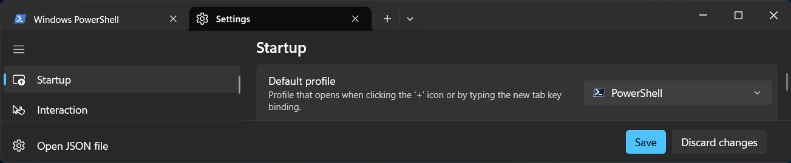

Source code for the hands-on sessions is available in Fortran and Python.
The following environment is required to run the programs.

## Fortran

Prepare a Fortran compiler such as gfortran.
The distributed code compiles and runs with gfortran-15.2.0.
For matrix multiplication, the intrinsic procedure `matmul` is used.
To compute a matrix inverse, a linear algebra library is required.
Although [OpenBLAS](https://www.openblas.net/) may be installed, LAPACK in Rtools is used on Windows and Accelerate.framework is used on macOS.

To visualize data produced with the Fortran programs, a graphics package is required. R scripts are included in the hands-on distribution.

## Python

Python is a general-purpose programming language that relies on libraries to extend its functionality.
Numpy provides mathematical functions and matrix manipulation, while Matplotlib is a standard visualization package.
The hands-on distribtuion was prepared using Python 3.14.7.

Participants unfamiliar with a terminal or editor may install [Jupyter](https://jupyter.org/) (see [Windows](#sec-jupyter-win), [Mac](#sec-jupyter-mac)) that allows to write and execute code directly in a web browser.

## Google Colaboratory

[Google Colaboratory](https://colab.research.google.com/) is a cloud service with a free tier available to anyone a Google account.
Note that the free version has stricter computational resource limits, and a stable network connection is required.

By default, Colab runs Python on CPU, but it can be changed to GPU or switched to R or Julia.

## Terminal

On Windows 11, Windows Terminal is the default terminal emulator instead of `cmd.exe`.
If it is not installed, search for and install in Microsoft Store.

Terminal.app on Mac is located in `/Applications/Utilities` or under ``Others'' in LaunchPad.

## Windows

On Windows, [winget](https://learn.microsoft.com/en-us/windows/package-manager/winget/) enables quick setup.

PowerShell 7 is used instead of Windows PowerShell (which is installed by default). 
To install PowerShell, search for `terminal` in the Start Menu and pin it to the Taskbar.
Run the following command to install PowerShell 7;

```powershell
winget install Microsoft.PowerShell
```

The profile for PowerShell 7 is created automatically, but you need to configure Windows Terminal to open PowerShell 7 by default.
Click the downward arrow in the title bar and select **Settings** (or press `Ctrl+,`).
Under **Default Profile** in the Startup settings, select PowerShell (represented by a black icon, not blue) and click Save in the lower-right corner.


### Install Python

*(Not needed if you are only using Fortran)*

```powershell
winget install Python.Python.3.14
```

In a new tab of Terminal, the path to `python` is automatically added.
To exit Python, type `quit()`.

```powershell
PowerShell 7.6.4
python
Python 3.14.7 (tags/v3.14.7:823f032, Aug  5 2026, 10:51:32) [MSC v.1944 64 bit (AMD64)] on win32
Type "help", "copyright", "credits" or "license" for more information.
>>> quit()
```

Install Numpy and Matplotlib with `pip`.

```powershell
pip install numpy matplotlib
```

### Install Jupyter {#sec-jupyter-win}

Install Jupyter if needed.

```powershell
pip install jupyter
```

When Jupyter Notebook launches, your default browser will open automatically.
The browser will display the current directory of your terminal.
You can use `cd` to navigate to a different directory before launching Jupyter:

```powershell
jupyter notebook
```

### Install an editor

To write source code, install your preferred code editor (pick just one):

```powershell
winget install Microsoft.Edit
winget install Neovim.Neovim
winget install GNU.Emacs
winget install Microsoft.VisualStudioCode
```

For those who have never used a text editor before, [`Microsoft.Edit`](https://learn.microsoft.com/ja-jp/windows/edit/) is recommended.
The tutorial for [Neovim](https://neovim.io/) can be launched by typing `:Tutor`.
The Emacs tutorial can be accessed by moving the cursor to `Emacs Tutorial` and pressing `Enter`.

### Install gfortran and R

R scripts are provided to visualize data produced by the Fortran binaries.
R is not needed if you use other visualizaton tools.
However, RTools provides a convenient way to install `gfortran` and LAPCK because it includes MinGW-w64, as recommended by Numpy [Build from source](https://numpy.org/doc/stable/building/index.html) guide.

```powershell
winget install RProject.R
winget install RProject.Rtools
```

To configure environment paths, edit your profile at `Documents\PowerShell\Microsoft.PowerShell_profile.ps1` (or `OneDrive\Documents...` if your account uses OneDrive.)
Create the `PowerShell` folder first if it does not already exist.

```powershell
edit $profile
```

```powershell
Remove-Alias -Name R # <1>
$env:PATH += "$env:ProgramFiles/R/R-4.6.1/bin;" # <2>
$env:PATH += "C:/rtools46/usr/bin;" # <3>
$env:PATH += "C:/rtools46/x86_w64-mingw32.static.posix/bin;" # <4>
```

1. In PowerShell `R` is an alias used to recall previous commands.
   Removing this alias avoids name conflicts, allowing you to run `R` directly instead of typing `R.exe`.
2. Path to `R.exe`.
3. Path to `make`.
4. Path to `gfortran`. Note that `x86_w64-mingw32.static.posix` depends on the platform and differ on ARM64 architectures.

Open a new terminal tab to verify gfortran installation.

```powershell
gfortran --version
```

## Mac

For the hands-on sessions, the official installer from python.org can be used.
Install Numpy and Matplotlib, and (optionally) Jupyter using `pip`.

For Fortran users, follow the instructions below to install `gfortran` and `R` using MacPorts.

### Install MacPorts

[MacPorts](https://www.macports.org/) is preferred over Homebrew because it provide a more robust and consistent environment.
The default install directory for MacPorts is `/opt/local`.

Follow [Installing MacPorts](https://www.macports.org/install.php).

Update macOS and use the `.pkg` installer for the your OS version.
The installer append `/opt/local/bin` to the `PATH` in `.zshrc`.


1. Install Apple's Command Line Developer Tools.

```zsh
sudo xcode-select --install
```

2. (Optional) Install Xcode from App Store and accept the license agreement:

```zsh
sudo xcodebuild -license
```

3. (Optional) Install `xorg-server` to use X11:

```zsh
sudo port install xorg-server
```

See `man port` or [documentation](https://guide.macports.org/#using) for further details.

### Install gfortran and R

`gfortran` is included as part of `gcc` package:

```
sudo port install gcc15
```

To allow multiple versions of gcc to coexist, the compiler binary is named `gfortran-mp-15` to include the major version number.
Run the following command:

```zsh
sudo port select gcc mp-gcc15
```

This sets gcc15 as the default and creates a `gfortran` alias (pointing `/opt/local/bin/gfortran-mp-15`.

For visualization, install R:

```zsh
sudo port install R
```
### Install Python

To install Python via MacPorts instead of the official installer, run the command below.
(Python is not required if you are only running the Fortran hands-on.)
To allow multiple versions to coexist, MacPorts appends version numbers to package names (e.g., py314-numpy).

`python314` is installed in `/opt/local/Library/Frameworks/Python.framework/Versions/3.14`.

```zsh
sudo port install python314
```

As indicated in the install messages, use `select` subcommand to set the active Python version.

```zsh
sudo port select python python314
```

Next, install Numpy and Matplotlib.

```zsh
sudo port install py314-numpy py314-matplotlib
```
*(Note: `python314` will automatically be installed as a dependency if it was not installed previously.)*

### Install Jupyter {#sec-jupyter-mac}

Jupyter can also be installed via MacPorts.

```zsh
sudo port install py314-jupyter
```
